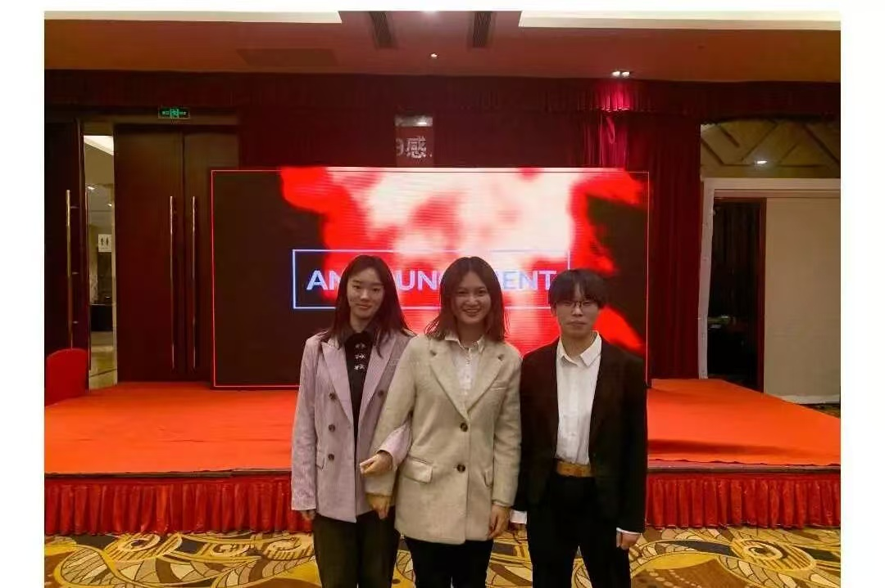
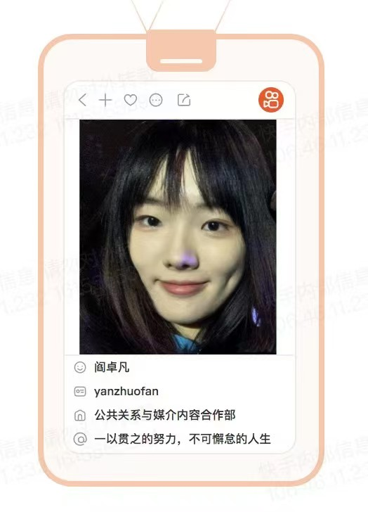
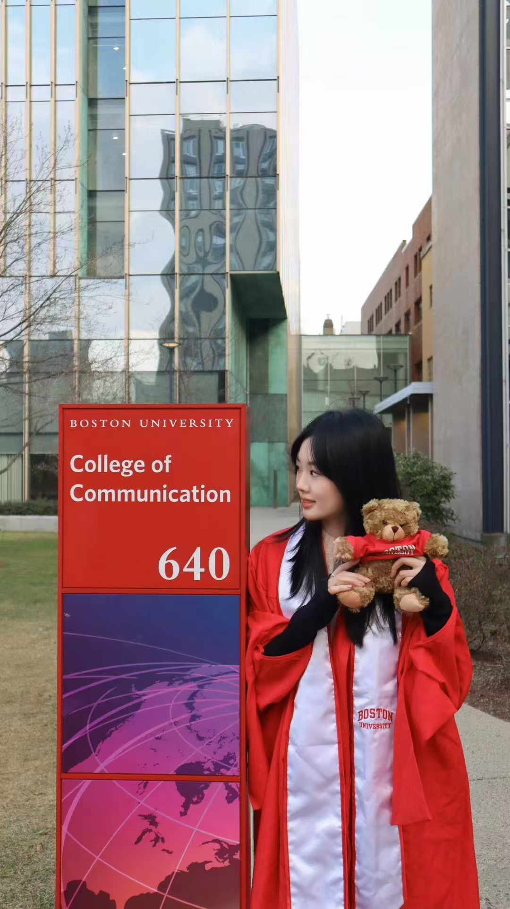
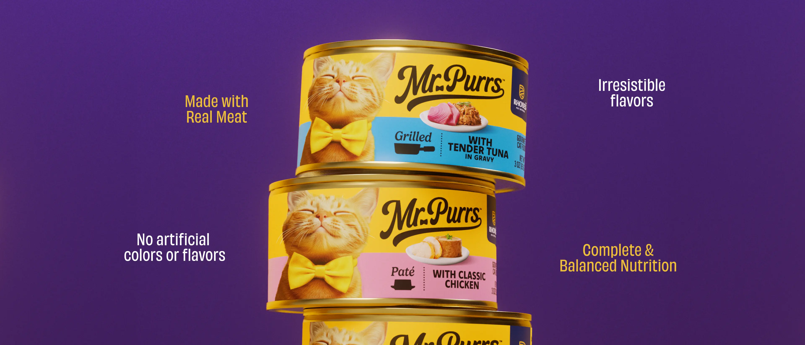
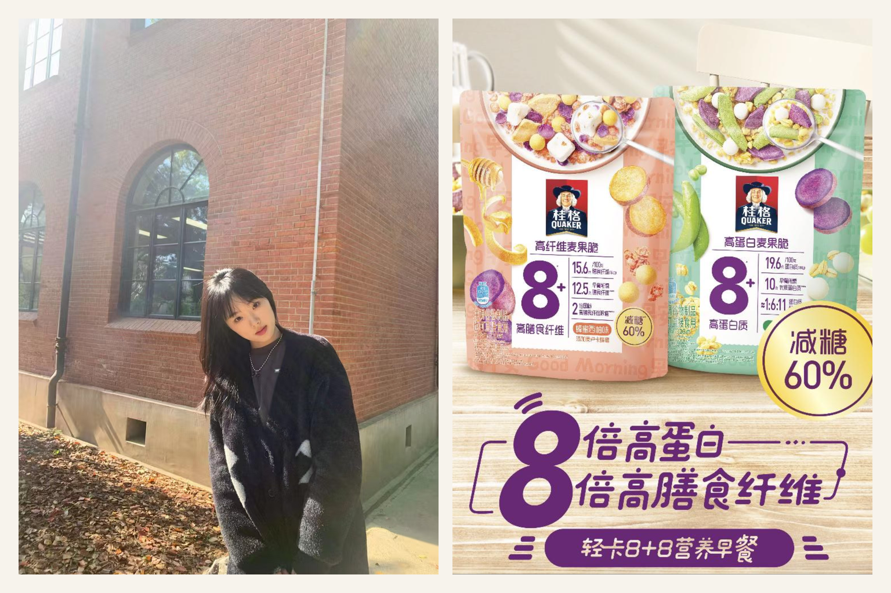
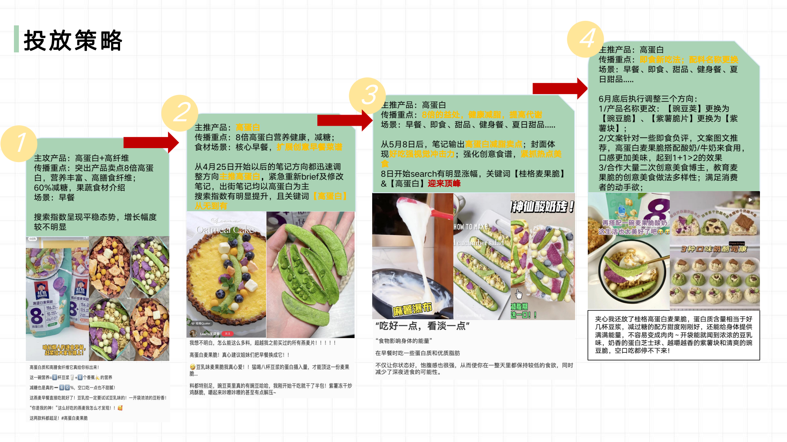
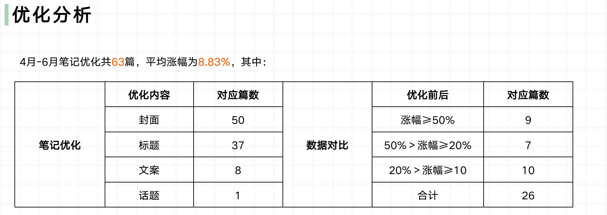
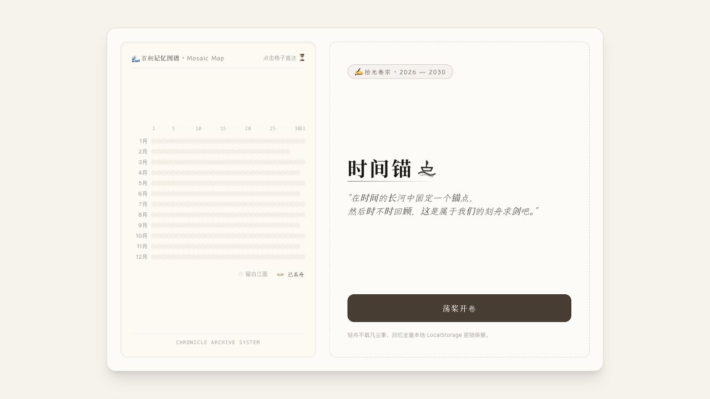
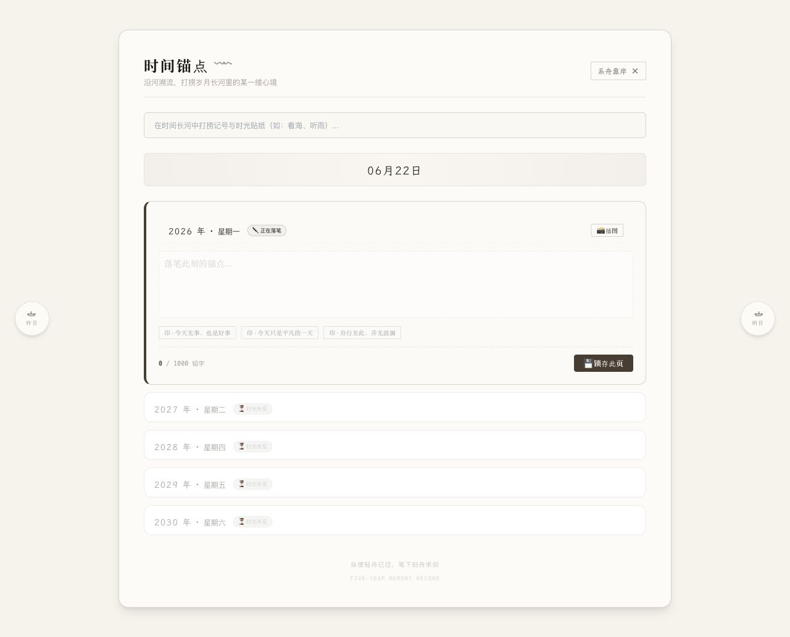

# Jovan Yan — Portfolio Website

> 本文件是网页实际内容框架。原则：先展示记忆点与产出，详细经历仅在用户主动展开时出现。

---

# 01 Hero

## Jovan Yan

> I turn observations about people into products, stories, and experiences they want to join.

I observe, research, build, and bring ideas to life.

**Product Marketing · Consumer Insight · Product Building · GTM**

按钮：

- Explore my work
- Let’s connect

**Hero 照片已确认**

- `assets/portfolio/jovan-yan-hero-portrait.jpeg`

---

# 02 About Me

## I work where product thinking meets go-to-market.

I understand both how products are built and how their value reaches people.

My marketing background helps me identify human needs and translate them into sharper product positioning. My product experience means I do not stop at strategy—I move ideas through development, execution, launch, and iteration.

## What I’m good at

### Finding product opportunities in human behavior

I turned conversations from an offline journaling community into a working five-year diary product.

### Taking an idea from zero to one

At ZURU, I moved product ideas through research, positioning, development, sampling, production, and launch.

### Making complex products understandable

At PepsiCo / Quaker, I translated nutritional and product benefits into relatable consumer scenarios and a multi-level creator strategy.

> I don’t see a strategy deck as the finish line. It is a tool for making something real.

---

# 03 Experience — My Journey

以六页翻书形式呈现。每页只保留：时间、地点、照片、一句话。

## Page 01 — Contents

**Shanghai → Beijing → Boston → Shenzhen**

## Page 02 — East China Normal University

**Shanghai · 2018–2022**

Business Administration  
AIESEC Overseas Volunteer Marketing Lead

> I first learned that participation does not happen automatically—it has to be designed.

**本科 / AIESEC 照片已确认**

- `assets/portfolio/jovan-yan-aiesec-university.jpeg`

## Page 03 — Kuaishou

**Beijing · 2021**

Public Relations & Communications Intern

> I learned how cultural signals and audience emotions become stories people choose to spread.

**Selected output**

- 100M+ Weibo topic views
- 107K followers gained in one day

**快手经历素材已确认**

- `assets/portfolio/jovan-yan-kuaishou-internship-card.jpeg`

## Page 04 — PepsiCo / Quaker

**Shanghai · 2022**

Product Marketing Intern

> I learned to connect product truth with the moments and language consumers actually care about.

**Selected output**

- 45M+ impressions
- 24% high-performing content rate
- 200K+ product reservations in two weeks

**需要素材**

- 1 张可公开的品牌、活动或工作照片

## Page 05 — Boston University

**Boston · 2022–2024**

M.S. in Marketing Research

> Boston gave my curiosity a research language.

**Boston / BU 照片已确认**

- `assets/portfolio/jovan-yan-boston-university-graduation.jpg`

## Page 06 — ZURU

**Shenzhen · 2024–2026**

NPD Junior Project Manager

> Product work taught me that an insight must survive cost, design, production, retail, and reality.

**Selected output**

- 1.4M first-order units for a Walmart canned cat food line
- 3–5% cost reduction
- 20% improvement in routine team efficiency

**ZURU 工作经历照片已确认**

- `assets/portfolio/jovan-yan-zuru-work.jpeg`

---

# 04 Selected Cases

首页只展示三张项目卡片。每张卡片包含：一句 Hook、一个角色标签、1–3 个结果数字。

## Case 01 — ZURU × Walmart

### From consumer insight to 1.4 million units

**Role:** End-to-end Product Owner  
**Market:** Europe & North America

I led a Walmart canned cat food line from research and positioning through innovation, development, sampling, production, and offline promotion.

**Impact**

- 1.4M first-order units confirmed in 2025 for Q1 2026 delivery
- 3–5% cost reduction
- End-to-end delivery across research, development, and production

Product image source: [Mr Purrs official website](https://www.mrpurrscatfood.com/)

**Short reflection**

The product delivered strong value and quality, but its differentiation was not strong enough to sustain expected sales. Today, I would test multiple value propositions earlier and identify which affordable difference genuinely changes purchase intent before increasing development investment.

**ZURU 产品图已确认**

- `assets/portfolio/mr-purrs-product-stack.webp`
- 如有，可再补充 1–2 张开发、打样或线下宣传图片

## Case 02 — PepsiCo / Quaker

### Turning product benefits into consumer relevance

**Role:** Product Marketing  
**Audience:** Urban women aged 20–35

For a new high-protein oat snack, I translated nutrition and ingredient benefits into relatable usage scenarios and built a multi-level creator matrix for awareness, trust, and conversion.

**Impact**

- 45M+ impressions
- 24% high-performing content rate
- 200K+ product reservations in two weeks
- 63 posts optimized, with an average performance uplift of 8.83%

### Strategy evolution

The campaign moved from broad nutrition messaging to a clearer high-protein proposition, then expanded into relatable breakfast, snack, dessert, fitness, and creative recipe scenarios.

### Content optimization

Across 63 optimized posts, average performance increased by 8.83%. Twenty-six posts improved by at least 10%, including nine that improved by 50% or more.

**Short reflection**

Today, I would connect online content with offline product experiences, validate consumer demand earlier in development, and expand the campaign beyond social seeding through livestreams, paid media, and more experimental short-form content.

**百事案例主视觉已确认**

- `assets/portfolio/jovan-yan-quaker-boston-diptych.png`
- `assets/portfolio/quaker-social-review/strategy-evolution.png`
- `assets/portfolio/quaker-social-review/content-optimization-results.png`
- 内部预算、达人报价、名单和带个人账号的评论页不公开

## Case 03 — Time Anchor

### A five-year diary for meeting your past self

**Role:** Independent Product Creator

After hearing journaling enthusiasts explain why physical five-year diaries were difficult to maintain, I independently designed and built a digital alternative that balances the ritual of handwriting with the feedback and searchability of digital tools.

**Core ideas**

- A five-year same-day timeline
- A visual annual memory map
- Keyword search across past entries
- Locked primary entries with reflective follow-up notes

**My process**

User observation → product definition → interaction and visual design → AI-assisted development → product audit and iteration planning

**AI collaboration**

- ChatGPT: requirement clarification, product structure, and content framework
- Gemini: prototype exploration, frontend design, and code implementation
- Me: priorities, trade-offs, experience principles, and final decisions

**Status**

Working prototype sourced directly from the local `5year-diary` project; external user testing has not started.

**Short reflection**

The next step is not adding more emotional features. It is strengthening saving reliability, backup, privacy communication, mobile navigation, accessibility, and long-term data storage.

**项目来源已确认**

- `/Users/zhuofan/Desktop/5year-diary`
- 网站实现时将直接嵌入交互预览，或发布为作品集子页面

---

# 05 Me & AI

## AI shortens the distance between observation and creation.

I use AI to investigate faster, structure ambiguity, prototype earlier, and bring ideas into a form people can experience.

### Research

Collecting market information, competitor parameters, and user feedback.

### Synthesis

Turning fragmented signals into user needs, market gaps, and decision material.

### Prototyping

Moving from an idea to a working interface without waiting for a full development team.

### Judgment

AI accelerates the work. I remain responsible for the question, priorities, trade-offs, and final decision.

---

# 06 Contact

## Let’s build something people want to join.

Have an idea, question, or interesting problem? Let’s connect.

- Email: yanzhuofan333@163.com
- Phone / WeChat: 13903992996

**微信二维码已确认**

- `assets/portfolio/jovan-yan-wechat-qr.jpg`

**需要补充**

- 是否提供英文简历下载

---

# 素材状态

网站核心内容与主要视觉素材已经齐全。

可选补充：

1. ZURU 打样或线下宣传图片
